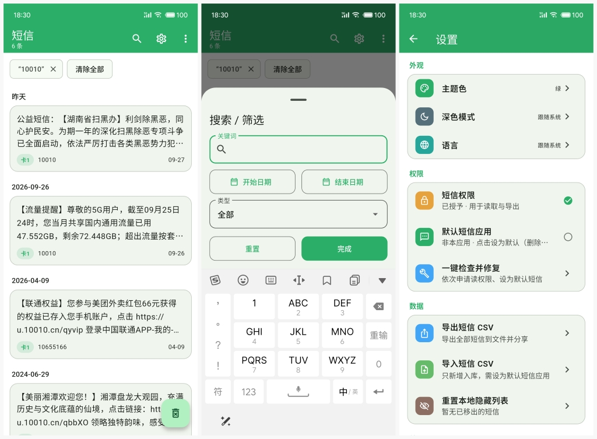

# 短信清理

[English](README.md) | 简体中文 | [繁體中文](README_zh_TW.md)

本地优先的 Android 短信 / 彩信清理工具（Flutter + Kotlin）。浏览、筛选、多选、导出、删除短信与彩信，数据只在本机处理，不上传、不收集。

## 功能

- 消息列表：按日期分组，卡片展示号码 / 正文 / 时间 / SIM；彩信带「彩信」徽章，含附件时标注
- 筛选搜索：关键词、日期范围、类型（收件箱 / 已发送 / 仅彩信）、同号、同卡
- 多选操作：长按进入多选，按 `uid` 对齐（SMS/MMS 同号不冲突），筛选后不错位；支持全选当前可见项
- 删除：单条滑删 / 动作 Sheet 删除 / 多选删除 / FAB 批量删除（均有确认）；按 `is_mms` 路由，不会误删对方同号行
- 移出列表：本地隐藏，不删系统数据，可重置
- 导出 CSV：全部或选中，RFC 4180 转义 + BOM，系统分享；含 `is_mms` 列
- 导入 CSV：与导出同格式；**只新增**写入系统短信库（需设为默认短信应用），不覆盖、不删除；**彩信行跳过**（无法简单重建）
- 权限中心：读短信、默认短信应用、一键检查修复；MIUI 附带「通知类短信」引导
- 主题：8 色色盘 + 浅色 / 深色 / 跟随系统
- 多语言：简体中文、繁体中文、English

### 彩信支持范围

纳入统一数据面：**浏览 / 筛选 / 删除 / 导出**。正文摘要取 `content://mms/part` 的文本 part（text/plain、vcard 等）；无文本时显示「[彩信]」占位，含图片/音频/视频附件时另标「含附件」。不做完整渲染（smil 布局 / 图片音频播放）。

**默认短信应用时的新彩信**：`MmsReceiver` 会把 `WAP_PUSH_DELIVER` 通知 **元数据入库**（发件人 / 时间 / 主题 / Message-ID / Content-Location）到 `content://mms/inbox` + `addr`，避免新彩信整条丢失。完整 smil / 图片 / 音频正文**不会下载重建**（依赖非公开 `PduPersister`，本应用不实现 MMS 客户端）；列表正文为占位「[彩信]」或主题摘要。需要完整彩信内容时，请在系统设置里把默认短信应用改回系统「信息」后再接收（或用系统应用收下后回到本工具清理）。

## 界面预览



## 权限与系统要求

| 能力 | 依赖 | 说明 |
|------|------|------|
| 读取短信/彩信 | `READ_SMS` | 列表、搜索、导出；彩信读取同权限，无需额外申请 |
| 删除短信/彩信 | 默认短信应用（`ROLE_SMS`） | Android 10+ 走 RoleManager |
| 写入 / 新短信入库 | 默认短信应用 | `SmsReceiver` 在默认时收信入库 |
| 新彩信入库 | 默认短信应用 | `MmsReceiver` 写通知元数据骨架（见「彩信支持范围」） |

冷启动不弹系统权限框；在设置或空态里主动申请。

### MIUI 注意

MIUI 在 `READ_SMS` 之外还有私有 **「通知类短信」** 开关（应用信息 → 权限管理 → 其他权限）。不开通时只能读到点对点短信，10086 / 银行等通知类会全部不可见。

该开关**无法用系统 API 代为授权**。应用在申请到读短信权限后会自动弹出引导，一键跳转 MIUI 权限页；首页也会在「可能未开通」时给出可关闭提示。

## 构建与运行

```bash
flutter pub get
flutter run
flutter test
flutter analyze
cd android && ./gradlew :app:testDebugUnitTest
flutter build apk --debug
flutter build apk --release
```

需要 Flutter 3.47+（Dart 3.13+），Android minSdk 29。

## 发布签名

release 使用随仓库分发的签名材料（与 1.x 一致）：

- `android/key.properties` — 口令与别名
- `android/app/key/sms.keystore` — 密钥库（`storeFile` 相对 `android/app/`）

```bash
flutter build apk --release
```

若缺少 `key.properties`，release 会回退 debug 签名（仅本地自测）。

## 项目结构

```
lib/
  main.dart                 # 入口
  app.dart                  # 主题与 MaterialApp
  theme/tokens.dart         # 色盘
  models/sms_item.dart      # 短信模型
  services/                 # 通道封装 / CSV / 隐藏列表
  features/
    list/                   # 首页、卡片、动作 Sheet
    filter/                 # 筛选模型与弹层
    delete/                 # 删除确认
    settings/               # 设置 / 主题 / 权限
    widgets/                # 空态
android/app/src/main/kotlin/com/dc16/sms/
  MainActivity.kt           # MethodChannel 分发
  SmsAccess.kt              # 查询 / 删除 / 权限 / MIUI
  SmsReceiver.kt            # 默认短信时收信入库
```


## 隐私

短信内容仅用于本机展示、筛选与导出；无网络上传，无统计上报。

## 许可

本项目采用 [MIT License](LICENSE) 开源。
