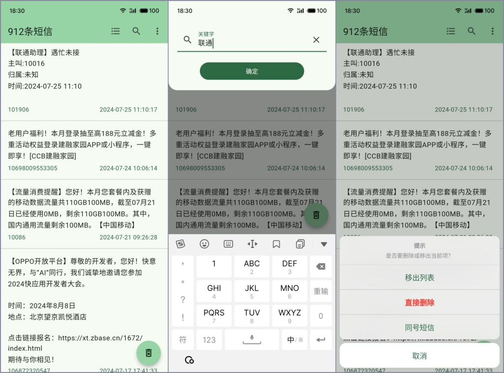

# 簡訊清理

[简体中文](README_zh.md) | 繁體中文 | [English](README.md)

- 簡訊清理是使用Flutter框架編寫的Android平台上讀取、批量刪除簡訊的清理工具。
- 雖然UI框架Flutter支援跨平台，但僅實現了Android簡訊刪除功能。

## 功能描述

- 獲取簡訊權限
- 複製簡訊到剪貼簿
- 設置/恢復預設簡訊應用
- 關鍵字過濾簡訊信息
- 同號碼簡訊搜索
- 從搜索結果移除/直接刪除簡訊
- 一鍵批量刪除查詢結果簡訊
- 一鍵導出所有簡訊到csv文件

## 界面截圖

## 開發環境
### [Flutter](https://docs.flutter.cn/get-started/install)
- flutter stable 3.29.1
- dart 3.7.0
- gradle 8.3
- gradle-plugin 8.1.4
- kotlin 1.8.22

### 編譯命令
- 安裝 flutter_distributor
- `dart pub global activate flutter_distributor`
- 打包release
- `flutter_distributor release --name apk`